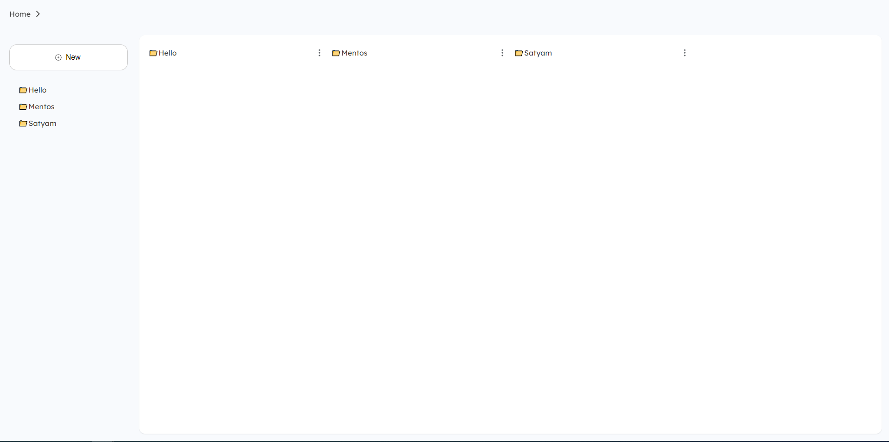
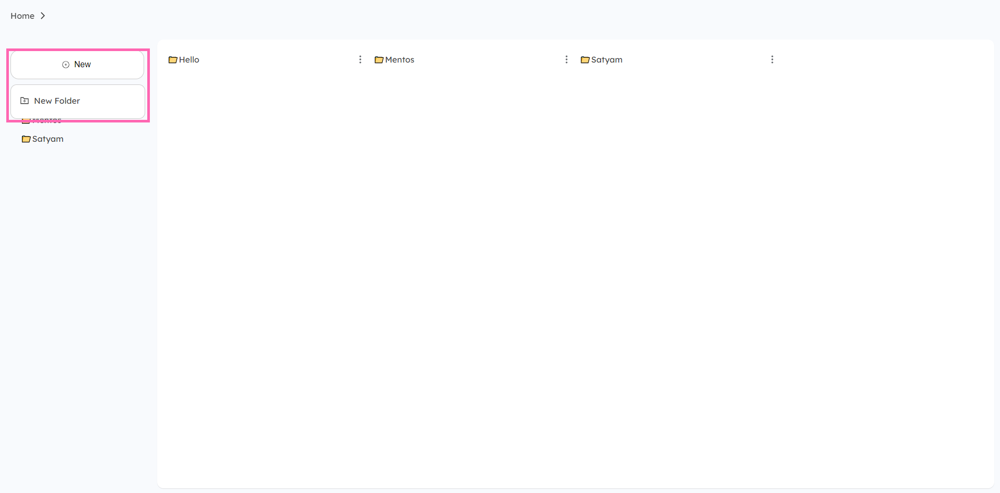
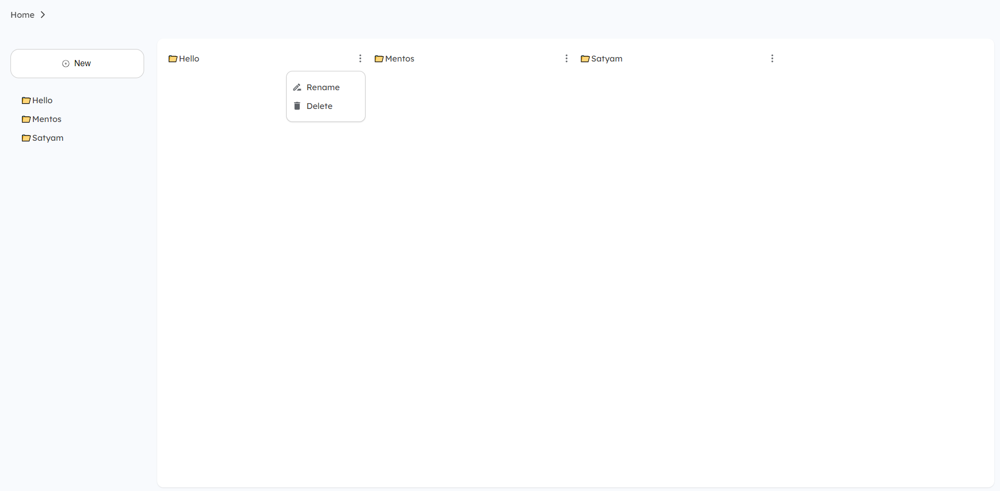
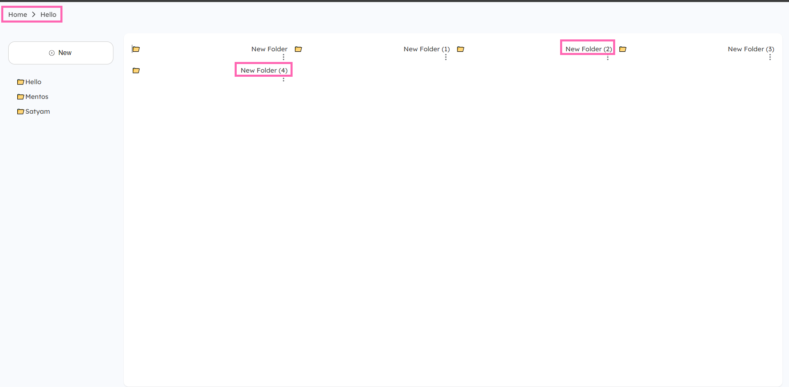

# Online Drive Application

## Overview
The Online Drive Application is a web-based storage solution that mimics functionalities of popular online drives like Google Drive. It allows users to manage their files and folders directly from their browser. Key features include the ability to create, rename, and delete folders both in the root directory and as subfolders.

## How It Works
The application is structured around a main layout component `WebLayout` which integrates several key components:
- **Breadcrumbs**: For displaying the current path within the file system.
- **FileExplorer**: Handles the display and interaction with files and folders.
- **Sidebar**: Provides quick actions like creating new folders or uploading files.
  
The backend logic for managing folders is handled through utilities for storing and retrieving folder data from local storage. New folders can be created with unique names by checking existing folder names, and similar logic is applied when creating subfolders.

### Components
- **Sidebar**: This component allows users to create new folders and manage uploads. It includes UI elements like buttons and icons to enhance user interaction.
- **FileExplorer**: Displays files and folders and allows users to interact with them, such as opening a folder or renaming a file.
- **FileExplorerDetailed**: A variant of FileExplorer tailored for navigating within subfolders.

### Routes
The application uses React Router for navigation:
- **Root ("/")**: Displays the main file explorer.
- **Folder ("/folder/:id")**: Handles navigation into subfolders, using the `FileExplorerDetailed` component to render the contents.

## Technologies Used
This project is built using the following technologies:
- **React**: for building the user interface.
- **React Router**: for navigation within the application.
- **Sass**: for styling.
- **React Icons**: for adding icons to the UI.

## Folder Structure
The project has a well-organized folder structure within the `src` directory, which helps in maintaining the codebase effectively:
- **assets/**: Contains all the static files like images and global styles.
- **components/**: Houses reusable UI components like buttons, modals, and inputs.
- **layouts/**: Includes layout components such as headers and footers that are common across different views.
- **routes/**: Manages the routing of the application, defining paths to different components.
- **styles/**: Contains Sass files for styling components and views.
- **utils/**: Includes utility functions that can be used across the application to perform various tasks like formatting data or managing state.

## Getting Started
These instructions will get you a copy of the project up and running on your local machine for development and testing purposes.

### Prerequisites
What things you need to install the software and how to install them:
```
- Node.js
- npm
```

### Installing
A step by step series of examples that tell you how to get a development environment running:

1. Clone the repo
   ```sh
   git clone https://yourprojectrepository.com
   ```
2. Install NPM packages
   ```sh
   npm install
   ```

### Running the Application
To start the application, run the following command in the project directory:
```sh
npm start
```

## Usage



- **UI**: This is how the UI looks as you can see the folders created on the right side and left side we have a sidebar for showing the folders.



- **Options on the Sidebar**: This how you can create folder and it will be displayed to the right side.



- **Menu Options**: This is how the rename and delete looks like, clicking on the rename button you will see a modal asking for the name and delete option will give you a window confirm alert which will if confirmed will be deleted the folder.



- **Naming Scheme**: As you can the naming scheme is also mentioned so that no duplicates folder can be created and also the breadcrumb for smooth navigation to the root directory. And for explorating to the other folders you can use sidebar navigation.


---
